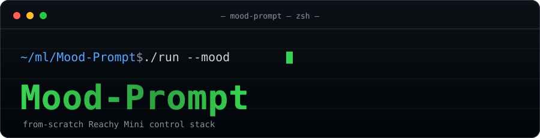

<p align="center">
  
</p>

<p align="center">
  <em>A from-scratch control stack for the Reachy Mini robot — written for the joy of it. 🤖💚</em>
</p>

<p align="center">
  <a href="LICENSE"></a>
  <a href="pyproject.toml"></a>
  <a href="https://mujoco.org"></a>
  <a href="https://docs.astral.sh/uv/"></a>
  
</p>

---

Our own Dynamixel Protocol 2.0 driver, Stewart-platform inverse kinematics,
pluggable hardware/MuJoCo-sim backend, WebSocket daemon + client, and a
mood/expression layer — the whole stack, built from scratch without depending
on `pip install reachy_mini`.

## Setup

This project uses [uv](https://docs.astral.sh/uv/) for dependency management.
`uv` provisions its own Python (3.11+) and a project-local `.venv`:

```bash
uv sync
```

`uv sync` installs the exact dependency versions pinned in `uv.lock`. The
`mujoco` (sim backend) and `websockets` (daemon) dependencies live in optional
groups:

```bash
uv sync --extra sim --extra daemon
```

Run commands through `uv run` (no manual venv activation needed), e.g.:

```bash
uv run pytest                                            # run the test suite
uv run --extra sim python scripts/smoke_mujoco.py        # open the MuJoCo viewer
```

## Project structure

```
Mood-Prompt/
├── .github/workflows/ci.yml           (pytest on Python 3.11 + 3.12 via uv)
├── .gitignore
├── .python-version                    (3.11)
├── README.md
├── LICENSE
├── pyproject.toml                     (deps: numpy, pyserial; extras: mujoco, websockets)
├── uv.lock                            (pinned dependency versions)
│
├── robot/                             # static assets (not generated by us)
│   ├── reachy_mini_description/       # URDF + MJCF + meshes (used by the sim backend)
│   └── reachy_mini_emotions_library/  # 81 mood trajectories + audio (used by moods/)
│
├── src/
│   └── mood_prompt/
│       ├── __init__.py
│       │
│       ├── protocol/                  # Dynamixel Protocol 2.0, from scratch
│       │   ├── crc.py                 # CRC-16 table + compute function
│       │   ├── packet.py              # instruction/status packet encode+decode
│       │   ├── instructions.py        # opcode constants (PING/READ/WRITE/SYNC_*)
│       │   └── control_table.py       # register addr/size constants (XL330/XC330)
│       │
│       ├── driver/                    # serial bus I/O layer
│       │   ├── bus.py                 # DynamixelBus: open serial port, send/recv packets
│       │   └── servo.py               # Servo: per-ID read/write of named registers
│       │
│       ├── kinematics/
│       │   ├── geometry.py            # Stewart platform attachment-point constants
│       │   └── stewart_ik.py          # closed-form rotary IK: pose -> 6 horn angles (+ FK)
│       │
│       ├── backend/                   # pluggable backend (hardware <-> sim swap)
│       │   ├── abstract.py            # Backend base class: enable/disable, goto, read state
│       │   ├── hardware.py            # HardwareBackend: drives driver/bus.py over real serial
│       │   └── mujoco_sim.py          # MujocoBackend: steps the MJCF via mujoco bindings
│       │
│       ├── daemon/
│       │   ├── server.py              # daemon process: owns one Backend, exposes WebSocket API
│       │   └── protocol_messages.py   # message schema for the daemon<->client WebSocket
│       │
│       ├── client/
│       │   └── mini_client.py         # MiniClient: WebSocket client (goto/set target, play move)
│       │
│       └── moods/
│           ├── library.py             # loads reachy_mini_emotions_library/*.json trajectories
│           └── selector.py            # mood string -> move name (stub lookup for now)
│
├── scripts/
│   ├── extract_stewart_geometry.py    # one-off: URDF -> Stewart geometry constants
│   ├── smoke_mujoco.py                # open the MuJoCo viewer and move the robot
│   ├── run_daemon.py                  # python scripts/run_daemon.py --backend sim|hardware
│   ├── list_moods.py                  # print all 81 moods + descriptions
│   └── play_mood.py                   # connect to a running daemon, play one named mood
│
├── tests/
│   ├── test_protocol_packet.py        # packet encode/decode + CRC known-answer tests
│   ├── test_mock_servo_bus.py         # DynamixelBus against a mock serial responder
│   ├── test_stewart_ik.py             # IK/FK round-trip within tolerance
│   ├── test_moods_library.py          # data validation on the emotion JSON files
│   └── mock_hardware/
│       └── fake_dynamixel_servo.py    # virtual serial responder speaking real Protocol 2.0 bytes
│
└── docs/
    ├── PLAN.md                        # architecture + technical reference (protocol + IK)
    └── TASKS.md                       # milestone/task breakdown
```

## Architecture

The stack mirrors the layered design Pollen Robotics uses, built ourselves end
to end: an app (e.g. `moods/`) talks to a `MiniClient`, which speaks our own
WebSocket protocol to a daemon. The daemon owns a single pluggable `Backend` —
either `HardwareBackend` (our Dynamixel driver + Stewart IK over a real serial
bus) or `MujocoBackend` (direct `ctrl`-array control of the MJCF). Everything
above the backend is identical in sim and on hardware, so the hardware backend
slots in later without touching the daemon, client, or app layers.

We don't own the physical robot yet, so all development runs against the MuJoCo
sim and a virtual Dynamixel servo (`tests/mock_hardware/`) that speaks real
Protocol 2.0 bytes — exercising the driver's full request/response/timeout path
without hardware.

## Acknowledgements

This is a for-fun project, inspired by the great open-source work from
[Pollen Robotics](https://www.pollen-robotics.com/) on **Reachy Mini** — their
[SDK](https://github.com/pollen-robotics/reachy_mini), robot description, and
[emotions library](https://huggingface.co/datasets/pollen-robotics/reachy_mini_emotions_library).
Thanks for making it all open source. 🙏

## License

[MIT](LICENSE)
